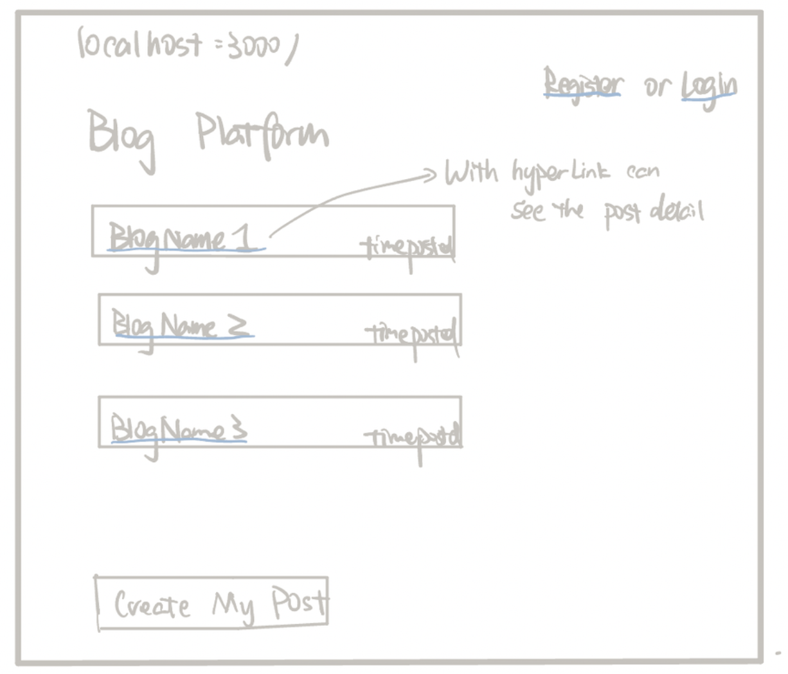
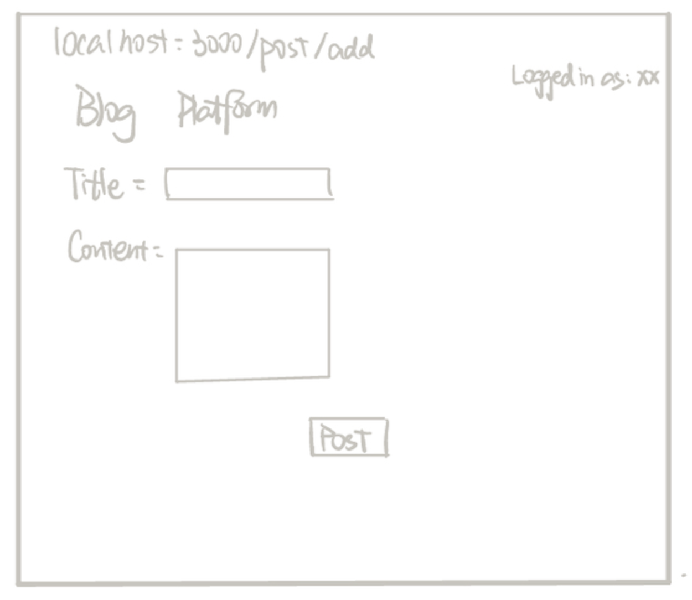
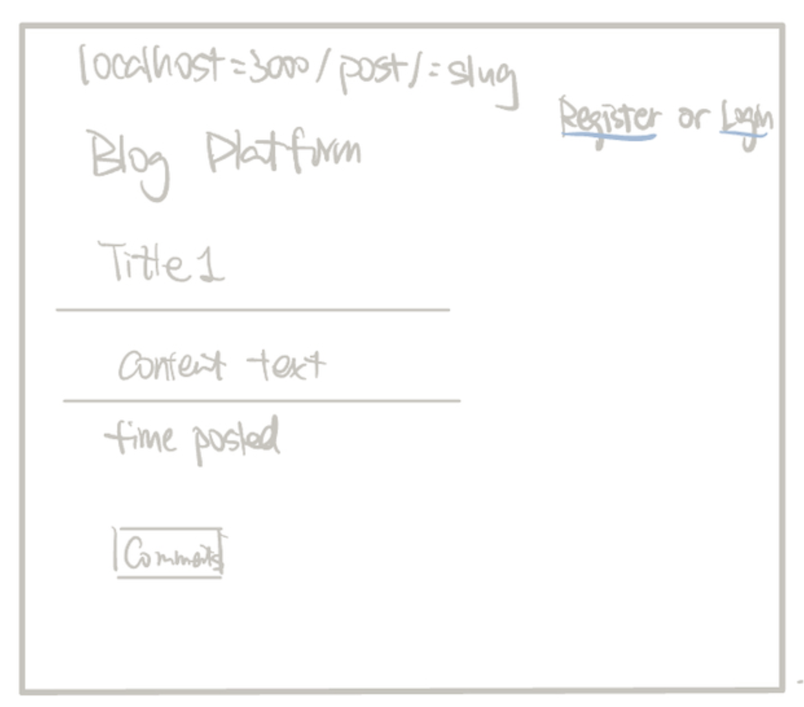
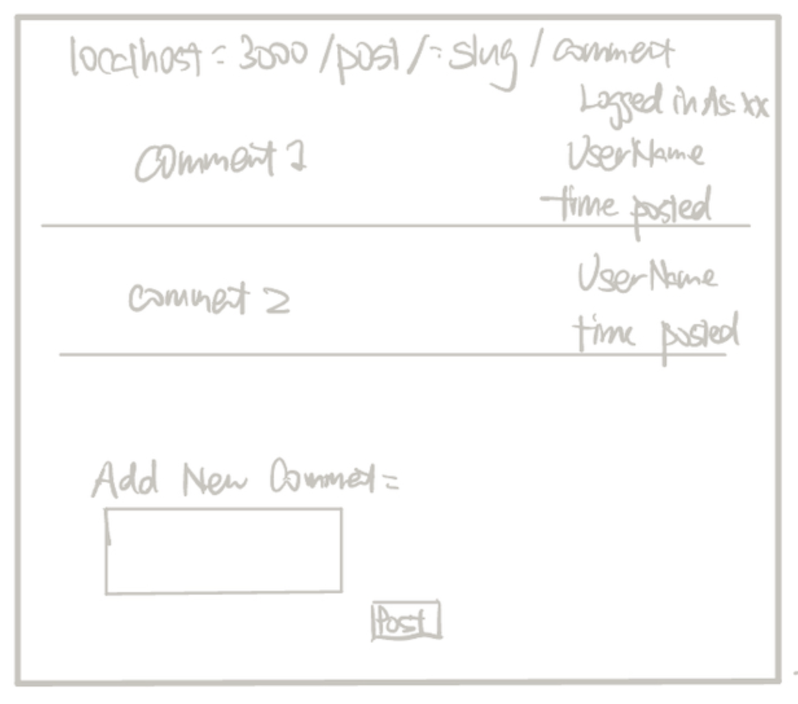
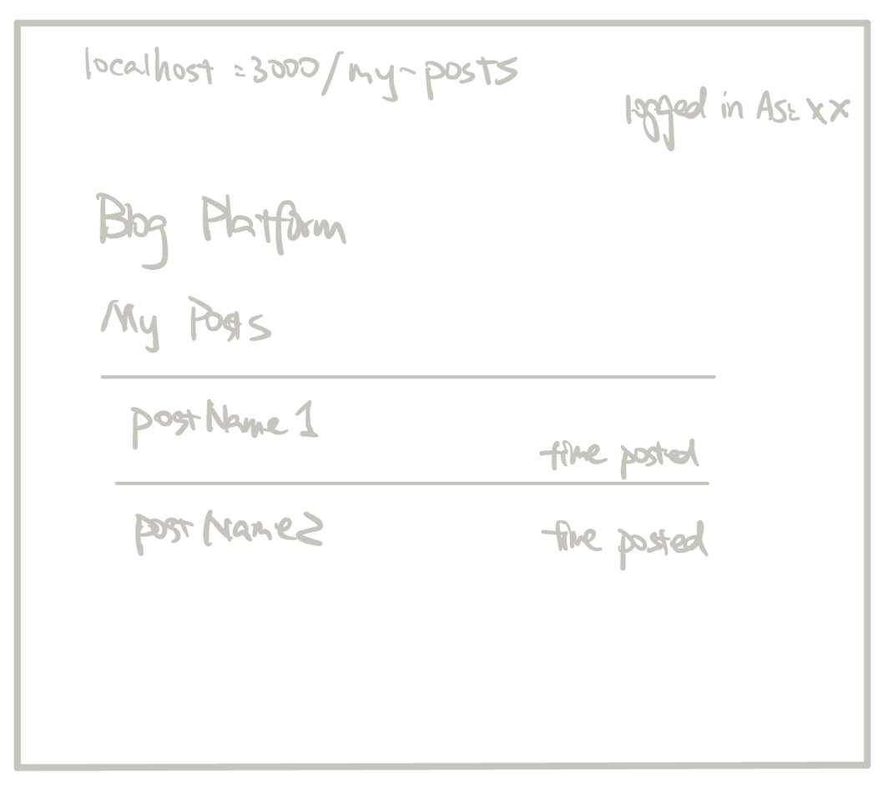
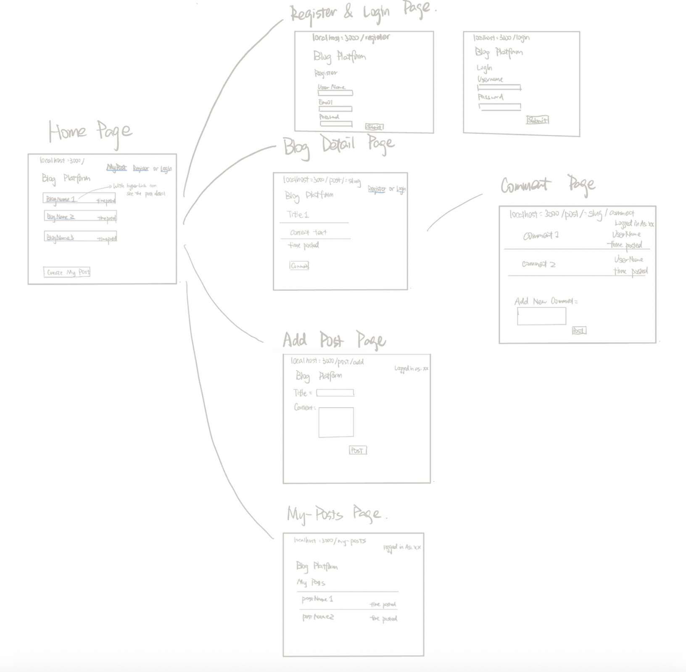

# Simple Blog Platform

## Overview

This project is a simple blogging platform that allows users to create, read, and comment on blog posts. It supports user registration and login functionalities. Logged-in users can add new posts, comment on existing posts, and view their own posts, while non-logged-in users can only view posts and details. User passwords are salted and hashed using bcrypt to ensure security.


## Data Model

The application will store data related to Users, Posts, and Comments.

- **Users**: Registered users who can create posts and comments.
- **Posts**: Blog entries created by users.
- **Comments**: Feedback or thoughts left by users on posts.

#### Sample Documents

An Example User:

```javascript
{
    username: "johndoe", 
    email: "johndoe@example.com",
    password: "hashed_password_here"
    createdAt: "2024-11-01T08:00:00Z"
}
```

An Example Post:

```javascript
{
    title: "My First Post",
    content: "This is the content of the post.",
    author: "user_id_here",
    tags: ["Introduction", "FirstPost"],
    createdAt: "2024-11-01T10:00:00Z",
    updatedAt: "2024-11-01T12:00:00Z"
}
```
```

An example Comment:

```javascript
{
    title: "My First Post",
    content: "This is the content of the post.",
    author: "user_id_here",
    tags: ["Introduction", "FirstPost"],
    createdAt: "2024-11-01T10:00:00Z",
    updatedAt: "2024-11-01T12:00:00Z"
}
```

## [Link to Commented First Draft Schema](model/index.js)

Already linked.

## Wireframes

/ - home, Lists all posts in reverse chronological order (latest first). Displays titles and publication times. Users can click a post to see its details.



post/add - A form for adding a new blog post. Accessible only when logged in.



/post/:slug - Displays the details of a specific post, including the author, published date, updated date, and comments.



/post/:slug/comment - A form for adding a comment to a specific post. Accessible only when logged in.



/my-posts - isplays a list of posts created by the logged-in user.



## Site map



## User Stories or Use Cases

1. **As a non-registered user, I can register a new account with the site**
    - Users who visit the platform without an account can register by providing a username, email, and password. This allows them to access more features, such as posting and commenting.
2. **As a user, I can log in to the site**
    - Registered users can log in using their username and password to access additional features, such as creating posts, commenting on others' posts, and viewing their own past posts.
3. **As a user, I can create a new blog post**
    - Logged-in users can create new blog posts by providing a title and content. Once the post is submitted, it will be published on the main page where all users can view it.
4. **As a user, I can view all blog posts**
    - All users (both logged-in and non-logged-in) can view all published blog posts on the home page. Posts are listed in reverse chronological order, with the latest posts appearing first. Users can click on a post to view more details.
5. **As a user, I can view the details of a specific post**
    - By clicking on a post title, users can view the post's full content, including the author's name, publication date, and any comments made on the post.
6. **As a user, I can comment on a blog post**
    - Logged-in users can add comments to any blog post. Comments include the user's name, content, and the date of the comment. Comments are displayed below the post details.
7. **As an author, I can edit my own blog posts**
    - Logged-in users who have created a post can edit the content of their own posts. This allows authors to correct mistakes or update information after the post has been published.
8. **As a user, I can view all of my past posts**
    - Logged-in users can view a list of all the posts they have created. This feature is accessible from the "My Posts" page, allowing users to manage or edit their content.
9. **As a user, I can delete my own comments**
    - Logged-in users can delete comments they have made on posts if they no longer want them to appear.

## Research Topics

(__TODO__: the research topics that you're planning on working on along with their point values... and the total points of research topics listed)

* **Use a front-end framework (6 points)**
    - Using React
* **Use a CSS Framework (2 points)**
    - Use a CSS framework such as Bootstrap, Tailwind CSS, or Semantic UI to style the application.
    - Customize the theme to avoid using the default style and ensure the application has a unique look.
    - Link to the customization in the repository and describe the changes made.
* **Configuration Management (3 points)**
    - Use `nconf` for configuration management to handle environment-specific settings.
    - Store different configurations for development and production environments.
    - Link to the relevant configuration code in the repository.


## [Link to Initial Main Project File](app.js)

Already Linked

## Annotations / References Used

2. [Express Documentation](https://expressjs.com/) - Reference for setting up the Express server.
2. [Mongoose Documentation](https://mongoosejs.com/docs/guide.html) - Guide for creating Mongoose schemas.
3. [Bcrypt Documentation](https://www.npmjs.com/package/bcrypt) - Used for password hashing.
4. [Handlebars Documentation](https://handlebarsjs.com/) - Used for creating dynamic frontend views.